# Homie - User Journey & Architecture Diagrams

This document contains comprehensive Mermaid diagrams illustrating user journeys, system architecture, and data flows for the Homie rental matching platform.

## Table of Contents
- [User Journey Flows](#user-journey-flows)
  - [Full Home Tenant Journey](#full-home-tenant-journey)
  - [Room/Flatmate Seeker Journey](#roomflatmate-seeker-journey)
  - [Landlord Journey](#landlord-journey)
- [System Architecture](#system-architecture)
- [Database Schema](#database-schema)
- [API Flow Diagrams](#api-flow-diagrams)

---

## User Journey Flows

### Full Home Tenant Journey

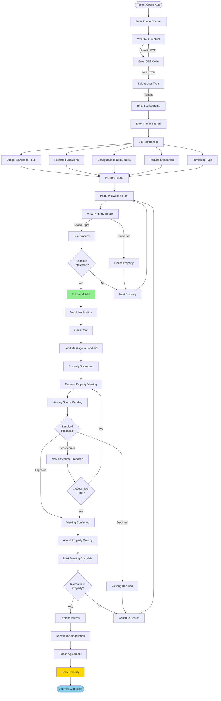
```mermaid
graph TD
    Start([Tenant Opens App]) --> PhoneInput[Enter Phone Number]
    PhoneInput --> OTPSent[OTP Sent via SMS]
    OTPSent --> VerifyOTP[Enter OTP Code]
    VerifyOTP --> |Invalid OTP| OTPSent
    VerifyOTP --> |Valid OTP| UserType[Select User Type]
    
    UserType --> |Tenant| TenantOnboarding[Tenant Onboarding]
    TenantOnboarding --> BasicInfo[Enter Name & Email]
    BasicInfo --> TenantPrefs[Set Preferences]
    
    TenantPrefs --> Budget[Budget Range: ₹5k-50k]
    TenantPrefs --> Location[Preferred Locations]
    TenantPrefs --> Config[Configuration: 1BHK-4BHK]
    TenantPrefs --> Amenities[Required Amenities]
    TenantPrefs --> Furnishing[Furnishing Type]
    
    Budget --> ProfileComplete[Profile Created]
    Location --> ProfileComplete
    Config --> ProfileComplete
    Amenities --> ProfileComplete
    Furnishing --> ProfileComplete
    
    ProfileComplete --> SwipeScreen[Property Swipe Screen]
    
    SwipeScreen --> ViewProperty[View Property Details]
    ViewProperty --> |Swipe Right| Like[Like Property]
    ViewProperty --> |Swipe Left| Dislike[Dislike Property]
    
    Like --> CheckMatch{Landlord<br/>Interested?}
    CheckMatch --> |Yes| Match[🎉 It's a Match!]
    CheckMatch --> |No| NextProperty[Next Property]
    
    Dislike --> NextProperty
    NextProperty --> SwipeScreen
    
    Match --> MatchNotification[Match Notification]
    MatchNotification --> OpenChat[Open Chat]
    
    OpenChat --> SendMessage[Send Message to Landlord]
    SendMessage --> Discussion[Property Discussion]
    
    Discussion --> RequestViewing[Request Property Viewing]
    RequestViewing --> ViewingPending[Viewing Status: Pending]
    
    ViewingPending --> LandlordResponse{Landlord<br/>Response}
    LandlordResponse --> |Approved| ViewingConfirmed[Viewing Confirmed]
    LandlordResponse --> |Rescheduled| NewDateTime[New Date/Time Proposed]
    LandlordResponse --> |Declined| ViewingDeclined[Viewing Declined]
    
    NewDateTime --> AcceptReschedule{Accept New<br/>Time?}
    AcceptReschedule --> |Yes| ViewingConfirmed
    AcceptReschedule --> |No| RequestViewing
    
    ViewingConfirmed --> AttendViewing[Attend Property Viewing]
    AttendViewing --> ViewingComplete[Mark Viewing Complete]
    
    ViewingComplete --> TenantDecision{Interested in<br/>Property?}
    TenantDecision --> |Yes| ExpressInterest[Express Interest]
    TenantDecision --> |No| ContinueSearch[Continue Search]
    
    ExpressInterest --> Negotiation[Rent/Terms Negotiation]
    Negotiation --> Agreement[Reach Agreement]
    Agreement --> BookProperty[Book Property]
    
    BookProperty --> End([Journey Complete])
    ContinueSearch --> SwipeScreen
    ViewingDeclined --> ContinueSearch
    
    style Match fill:#90EE90
    style BookProperty fill:#FFD700
    style End fill:#87CEEB
```

### Room/Flatmate Seeker Journey

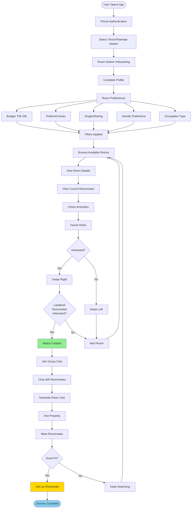
```mermaid
graph TD
    Start([User Opens App]) --> Auth[Phone Authentication]
    Auth --> SelectType[Select: Room/Flatmate Seeker]
    
    SelectType --> Onboarding[Room Seeker Onboarding]
    Onboarding --> Profile[Complete Profile]
    
    Profile --> RoomPrefs[Room Preferences]
    RoomPrefs --> Budget[Budget: ₹3k-25k]
    RoomPrefs --> Location[Preferred Areas]
    RoomPrefs --> RoomType[Single/Sharing]
    RoomPrefs --> Gender[Gender Preference]
    RoomPrefs --> Occupation[Occupation Type]
    
    Budget --> FiltersSet[Filters Applied]
    Location --> FiltersSet
    RoomType --> FiltersSet
    Gender --> FiltersSet
    Occupation --> FiltersSet
    
    FiltersSet --> Browse[Browse Available Rooms]
    Browse --> ViewRoom[View Room Details]
    
    ViewRoom --> CheckRoommates[View Current Roommates]
    CheckRoommates --> CheckAmenities[Check Amenities]
    CheckAmenities --> CheckRules[House Rules]
    
    CheckRules --> Interest{Interested?}
    Interest --> |Yes| SwipeRight[Swipe Right]
    Interest --> |No| SwipeLeft[Swipe Left]
    
    SwipeRight --> MatchCheck{Landlord/<br/>Roommates<br/>Interested?}
    MatchCheck --> |Yes| RoomMatch[Match Created]
    MatchCheck --> |No| NextRoom[Next Room]
    
    SwipeLeft --> NextRoom
    NextRoom --> Browse
    
    RoomMatch --> GroupChat[Join Group Chat]
    GroupChat --> MeetRoommates[Chat with Roommates]
    MeetRoommates --> ScheduleVisit[Schedule Room Visit]
    
    ScheduleVisit --> Visit[Visit Property]
    Visit --> MeetInPerson[Meet Roommates]
    
    MeetInPerson --> Compatible{Good Fit?}
    Compatible --> |Yes| JoinRoom[Join as Roommate]
    Compatible --> |No| ContinueSearching[Keep Searching]
    
    JoinRoom --> End([Journey Complete])
    ContinueSearching --> Browse
    
    style RoomMatch fill:#90EE90
    style JoinRoom fill:#FFD700
    style End fill:#87CEEB
```

### Landlord Journey

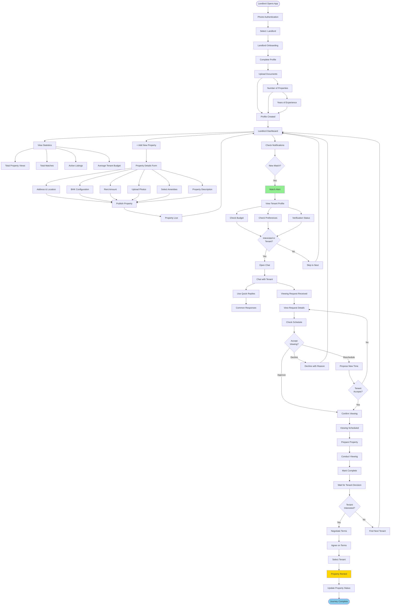
```mermaid
graph TD
    Start([Landlord Opens App]) --> Auth[Phone Authentication]
    Auth --> SelectType[Select: Landlord]
    
    SelectType --> LLOnboarding[Landlord Onboarding]
    LLOnboarding --> LLProfile[Complete Profile]
    
    LLProfile --> VerifyDocs[Upload Documents]
    VerifyDocs --> PropertyCount[Number of Properties]
    PropertyCount --> ExperienceYears[Years of Experience]
    
    VerifyDocs --> ProfileReady[Profile Created]
    PropertyCount --> ProfileReady
    ExperienceYears --> ProfileReady
    
    ProfileReady --> Dashboard[Landlord Dashboard]
    
    Dashboard --> ViewStats[View Statistics]
    ViewStats --> TotalViews[Total Property Views]
    ViewStats --> MatchCount[Total Matches]
    ViewStats --> ActiveListings[Active Listings]
    ViewStats --> AvgBudget[Average Tenant Budget]
    
    Dashboard --> AddProperty[+ Add New Property]
    
    AddProperty --> PropertyForm[Property Details Form]
    PropertyForm --> Address[Address & Location]
    PropertyForm --> Configuration[BHK Configuration]
    PropertyForm --> Rent[Rent Amount]
    PropertyForm --> Photos[Upload Photos]
    PropertyForm --> Amenities[Select Amenities]
    PropertyForm --> Description[Property Description]
    
    Address --> PublishProperty[Publish Property]
    Configuration --> PublishProperty
    Rent --> PublishProperty
    Photos --> PublishProperty
    Amenities --> PublishProperty
    Description --> PublishProperty
    
    PublishProperty --> PropertyLive[Property Live]
    PropertyLive --> Dashboard
    
    Dashboard --> Notifications[Check Notifications]
    Notifications --> NewMatch{New Match?}
    
    NewMatch --> |Yes| MatchAlert[Match Alert]
    MatchAlert --> ViewTenant[View Tenant Profile]
    
    ViewTenant --> TenantBudget[Check Budget]
    ViewTenant --> TenantPrefs[Check Preferences]
    ViewTenant --> TenantVerification[Verification Status]
    
    TenantBudget --> LLDecision{Interested in<br/>Tenant?}
    TenantPrefs --> LLDecision
    TenantVerification --> LLDecision
    
    LLDecision --> |Yes| OpenChat[Open Chat]
    LLDecision --> |No| SkipMatch[Skip to Next]
    
    SkipMatch --> Dashboard
    
    OpenChat --> ChatTenant[Chat with Tenant]
    ChatTenant --> QuickReplies[Use Quick Replies]
    QuickReplies --> ResponseTemplates[Common Responses]
    
    ChatTenant --> ReceiveViewingRequest[Viewing Request Received]
    
    ReceiveViewingRequest --> ViewRequest[View Request Details]
    ViewRequest --> CheckSchedule[Check Schedule]
    
    CheckSchedule --> ViewingDecision{Accept<br/>Viewing?}
    ViewingDecision --> |Approve| ConfirmViewing[Confirm Viewing]
    ViewingDecision --> |Reschedule| ProposeNewTime[Propose New Time]
    ViewingDecision --> |Decline| DeclineViewing[Decline with Reason]
    
    ProposeNewTime --> TenantAccepts{Tenant<br/>Accepts?}
    TenantAccepts --> |Yes| ConfirmViewing
    TenantAccepts --> |No| ViewRequest
    
    ConfirmViewing --> ViewingScheduled[Viewing Scheduled]
    ViewingScheduled --> PrepareProperty[Prepare Property]
    
    PrepareProperty --> ConductViewing[Conduct Viewing]
    ConductViewing --> MarkComplete[Mark Complete]
    
    MarkComplete --> TenantFeedback[Wait for Tenant Decision]
    
    TenantFeedback --> TenantInterested{Tenant<br/>Interested?}
    TenantInterested --> |Yes| Negotiate[Negotiate Terms]
    TenantInterested --> |No| NextTenant[Find Next Tenant]
    
    Negotiate --> FinalTerms[Agree on Terms]
    FinalTerms --> SelectTenant[Select Tenant]
    
    SelectTenant --> PropertyRented[Property Rented]
    PropertyRented --> UpdateStatus[Update Property Status]
    UpdateStatus --> End([Journey Complete])
    
    NextTenant --> Dashboard
    DeclineViewing --> Dashboard
    
    style MatchAlert fill:#90EE90
    style PropertyRented fill:#FFD700
    style End fill:#87CEEB
```

---

## System Architecture

### High-Level Architecture

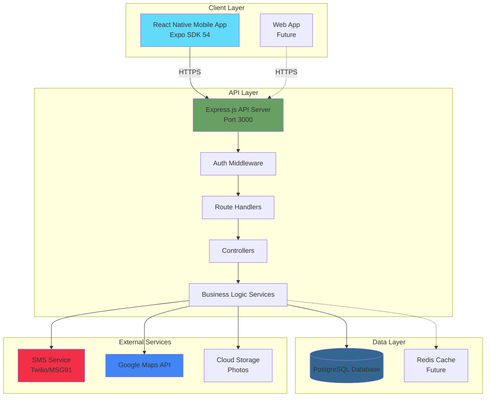
```mermaid
graph TB
    subgraph "Client Layer"
        Mobile[React Native Mobile App<br/>Expo SDK 54]
        WebApp[Web App<br/>Future]
    end
    
    subgraph "API Layer"
        API[Express.js API Server<br/>Port 3000]
        Auth[Auth Middleware]
        Routes[Route Handlers]
        Controllers[Controllers]
        Services[Business Logic Services]
    end
    
    subgraph "Data Layer"
        DB[(PostgreSQL Database)]
        Cache[Redis Cache<br/>Future]
    end
    
    subgraph "External Services"
        SMS[SMS Service<br/>Twilio/MSG91]
        Maps[Google Maps API]
        Storage[Cloud Storage<br/>Photos]
    end
    
    Mobile --> |HTTPS| API
    WebApp -.-> |HTTPS| API
    
    API --> Auth
    Auth --> Routes
    Routes --> Controllers
    Controllers --> Services
    
    Services --> DB
    Services -.-> Cache
    Services --> SMS
    Services --> Maps
    Services --> Storage
    
    style Mobile fill:#61DAFB
    style API fill:#68A063
    style DB fill:#336791
    style SMS fill:#F22F46
    style Maps fill:#4285F4
```

### API Request Flow

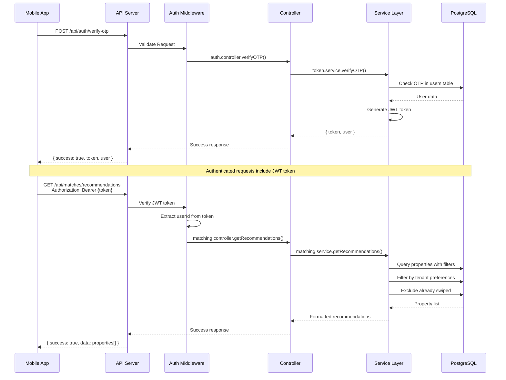
```mermaid
sequenceDiagram
    participant Mobile as Mobile App
    participant API as API Server
    participant Auth as Auth Middleware
    participant Controller as Controller
    participant Service as Service Layer
    participant DB as PostgreSQL
    
    Mobile->>API: POST /api/auth/verify-otp
    API->>Auth: Validate Request
    Auth->>Controller: auth.controller.verifyOTP()
    Controller->>Service: token.service.verifyOTP()
    Service->>DB: Check OTP in users table
    DB-->>Service: User data
    Service->>Service: Generate JWT token
    Service-->>Controller: { token, user }
    Controller-->>API: Success response
    API-->>Mobile: { success: true, token, user }
    
    Note over Mobile,DB: Authenticated requests include JWT token
    
    Mobile->>API: GET /api/matches/recommendations<br/>Authorization: Bearer {token}
    API->>Auth: Verify JWT token
    Auth->>Auth: Extract userId from token
    Auth->>Controller: matching.controller.getRecommendations()
    Controller->>Service: matching.service.getRecommendations()
    Service->>DB: Query properties with filters
    Service->>DB: Filter by tenant preferences
    Service->>DB: Exclude already swiped
    DB-->>Service: Property list
    Service-->>Controller: Formatted recommendations
    Controller-->>API: Success response
    API-->>Mobile: { success: true, data: properties[] }
```

---

## Database Schema

### Entity Relationship Diagram

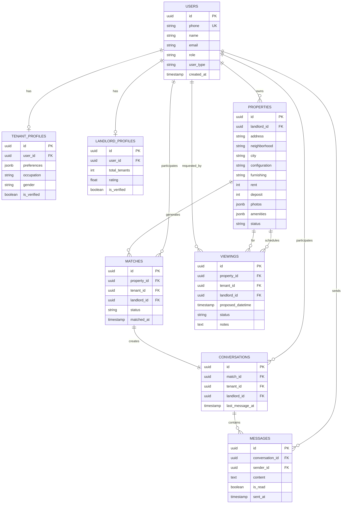
```mermaid
erDiagram
    USERS ||--o| TENANT_PROFILES : has
    USERS ||--o| LANDLORD_PROFILES : has
    USERS ||--o{ PROPERTIES : owns
    USERS ||--o{ MATCHES : participates
    USERS ||--o{ CONVERSATIONS : participates
    USERS ||--o{ MESSAGES : sends
    
    PROPERTIES ||--o{ MATCHES : generates
    PROPERTIES ||--o{ VIEWINGS : schedules
    
    MATCHES ||--|| CONVERSATIONS : creates
    CONVERSATIONS ||--o{ MESSAGES : contains
    
    VIEWINGS }o--|| PROPERTIES : for
    VIEWINGS }o--|| USERS : requested_by
    
    USERS {
        uuid id PK
        string phone UK
        string name
        string email
        string role
        string user_type
        timestamp created_at
    }
    
    TENANT_PROFILES {
        uuid id PK
        uuid user_id FK
        jsonb preferences
        string occupation
        string gender
        boolean is_verified
    }
    
    LANDLORD_PROFILES {
        uuid id PK
        uuid user_id FK
        int total_tenants
        float rating
        boolean is_verified
    }
    
    PROPERTIES {
        uuid id PK
        uuid landlord_id FK
        string address
        string neighborhood
        string city
        string configuration
        string furnishing
        int rent
        int deposit
        jsonb photos
        jsonb amenities
        string status
    }
    
    MATCHES {
        uuid id PK
        uuid property_id FK
        uuid tenant_id FK
        uuid landlord_id FK
        string status
        timestamp matched_at
    }
    
    CONVERSATIONS {
        uuid id PK
        uuid match_id FK
        uuid tenant_id FK
        uuid landlord_id FK
        timestamp last_message_at
    }
    
    MESSAGES {
        uuid id PK
        uuid conversation_id FK
        uuid sender_id FK
        text content
        boolean is_read
        timestamp sent_at
    }
    
    VIEWINGS {
        uuid id PK
        uuid property_id FK
        uuid tenant_id FK
        uuid landlord_id FK
        timestamp proposed_datetime
        string status
        text notes
    }
```

### Data Flow - Property Matching

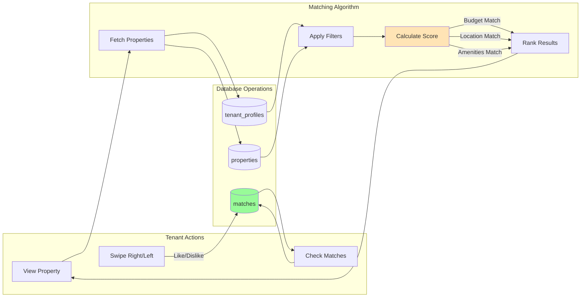
```mermaid
graph LR
    subgraph "Tenant Actions"
        T1[View Property]
        T2[Swipe Right/Left]
        T3[Check Matches]
    end
    
    subgraph "Matching Algorithm"
        M1[Fetch Properties]
        M2[Apply Filters]
        M3[Calculate Score]
        M4[Rank Results]
    end
    
    subgraph "Database Operations"
        D1[(tenant_profiles)]
        D2[(properties)]
        D3[(matches)]
    end
    
    T1 --> M1
    M1 --> D1
    M1 --> D2
    D1 --> M2
    D2 --> M2
    
    M2 --> M3
    M3 --> |Budget Match| M4
    M3 --> |Location Match| M4
    M3 --> |Amenities Match| M4
    
    M4 --> T1
    
    T2 --> |Like/Dislike| D3
    T3 --> D3
    D3 --> T3
    
    style M3 fill:#FFE4B5
    style D3 fill:#98FB98
```

---

## API Flow Diagrams

### Authentication Flow

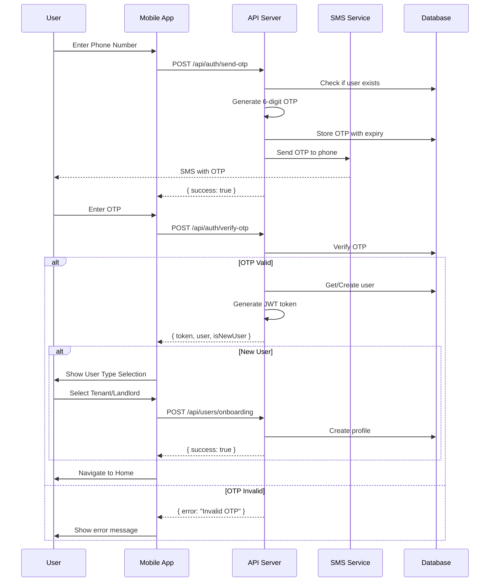
```mermaid
sequenceDiagram
    participant User as User
    participant App as Mobile App
    participant API as API Server
    participant SMS as SMS Service
    participant DB as Database
    
    User->>App: Enter Phone Number
    App->>API: POST /api/auth/send-otp
    API->>DB: Check if user exists
    API->>API: Generate 6-digit OTP
    API->>DB: Store OTP with expiry
    API->>SMS: Send OTP to phone
    SMS-->>User: SMS with OTP
    API-->>App: { success: true }
    
    User->>App: Enter OTP
    App->>API: POST /api/auth/verify-otp
    API->>DB: Verify OTP
    alt OTP Valid
        API->>DB: Get/Create user
        API->>API: Generate JWT token
        API-->>App: { token, user, isNewUser }
        
        alt New User
            App->>User: Show User Type Selection
            User->>App: Select Tenant/Landlord
            App->>API: POST /api/users/onboarding
            API->>DB: Create profile
            API-->>App: { success: true }
        end
        
        App->>User: Navigate to Home
    else OTP Invalid
        API-->>App: { error: "Invalid OTP" }
        App->>User: Show error message
    end
```

### Property Swipe & Match Flow

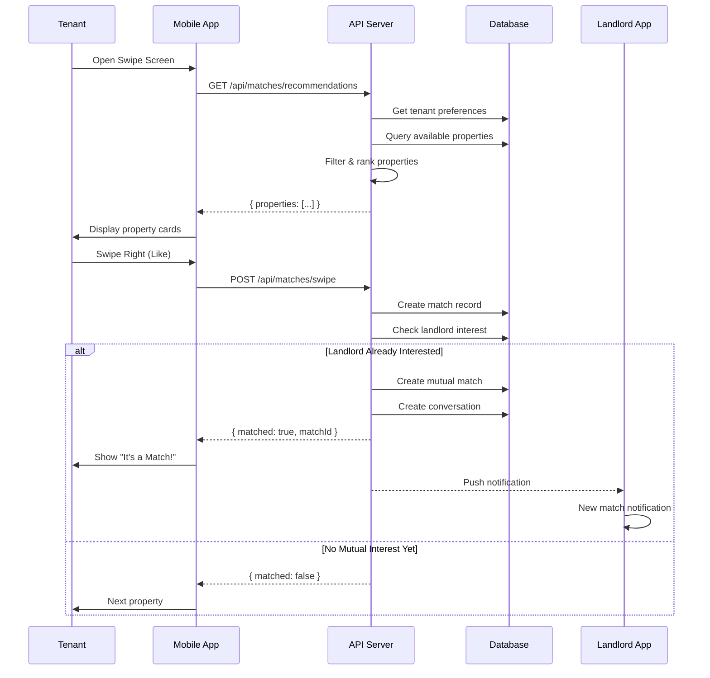
```mermaid
sequenceDiagram
    participant Tenant as Tenant
    participant App as Mobile App
    participant API as API Server
    participant DB as Database
    participant Landlord as Landlord App
    
    Tenant->>App: Open Swipe Screen
    App->>API: GET /api/matches/recommendations
    API->>DB: Get tenant preferences
    API->>DB: Query available properties
    API->>API: Filter & rank properties
    API-->>App: { properties: [...] }
    App->>Tenant: Display property cards
    
    Tenant->>App: Swipe Right (Like)
    App->>API: POST /api/matches/swipe
    API->>DB: Create match record
    API->>DB: Check landlord interest
    
    alt Landlord Already Interested
        API->>DB: Create mutual match
        API->>DB: Create conversation
        API-->>App: { matched: true, matchId }
        App->>Tenant: Show "It's a Match!" 
        API-->>Landlord: Push notification
        Landlord->>Landlord: New match notification
    else No Mutual Interest Yet
        API-->>App: { matched: false }
        App->>Tenant: Next property
    end
```

### Viewing Request Flow

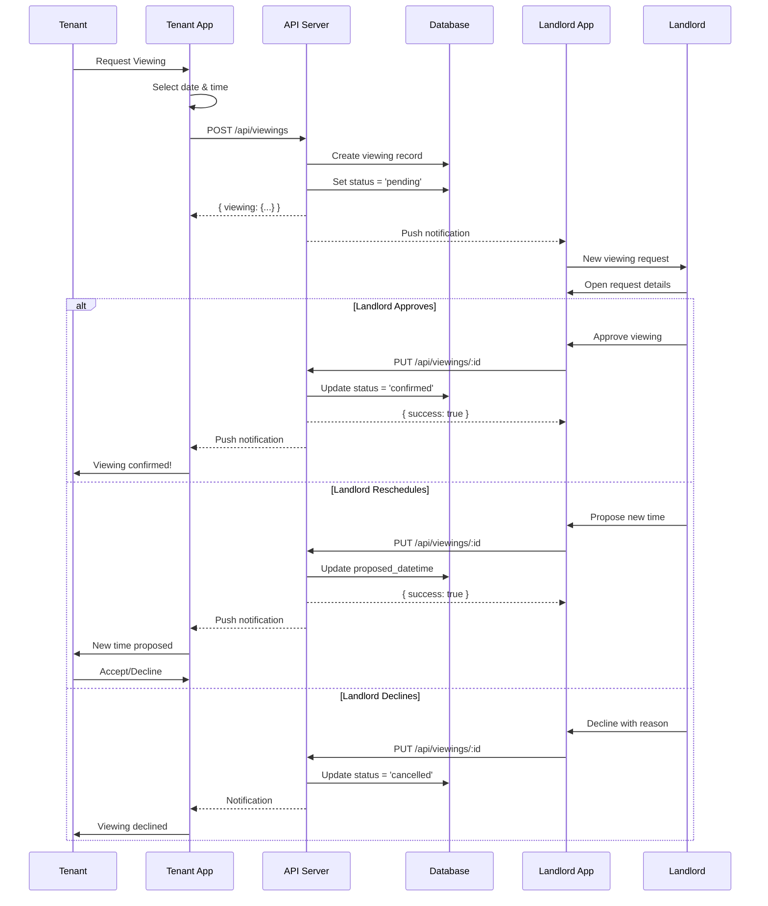
```mermaid
sequenceDiagram
    participant Tenant as Tenant
    participant TApp as Tenant App
    participant API as API Server
    participant DB as Database
    participant LApp as Landlord App
    participant Landlord as Landlord
    
    Tenant->>TApp: Request Viewing
    TApp->>TApp: Select date & time
    TApp->>API: POST /api/viewings
    API->>DB: Create viewing record
    API->>DB: Set status = 'pending'
    API-->>TApp: { viewing: {...} }
    API-->>LApp: Push notification
    
    LApp->>Landlord: New viewing request
    Landlord->>LApp: Open request details
    
    alt Landlord Approves
        Landlord->>LApp: Approve viewing
        LApp->>API: PUT /api/viewings/:id
        API->>DB: Update status = 'confirmed'
        API-->>LApp: { success: true }
        API-->>TApp: Push notification
        TApp->>Tenant: Viewing confirmed!
    else Landlord Reschedules
        Landlord->>LApp: Propose new time
        LApp->>API: PUT /api/viewings/:id
        API->>DB: Update proposed_datetime
        API-->>LApp: { success: true }
        API-->>TApp: Push notification
        TApp->>Tenant: New time proposed
        Tenant->>TApp: Accept/Decline
    else Landlord Declines
        Landlord->>LApp: Decline with reason
        LApp->>API: PUT /api/viewings/:id
        API->>DB: Update status = 'cancelled'
        API-->>TApp: Notification
        TApp->>Tenant: Viewing declined
    end
```

### Chat Message Flow

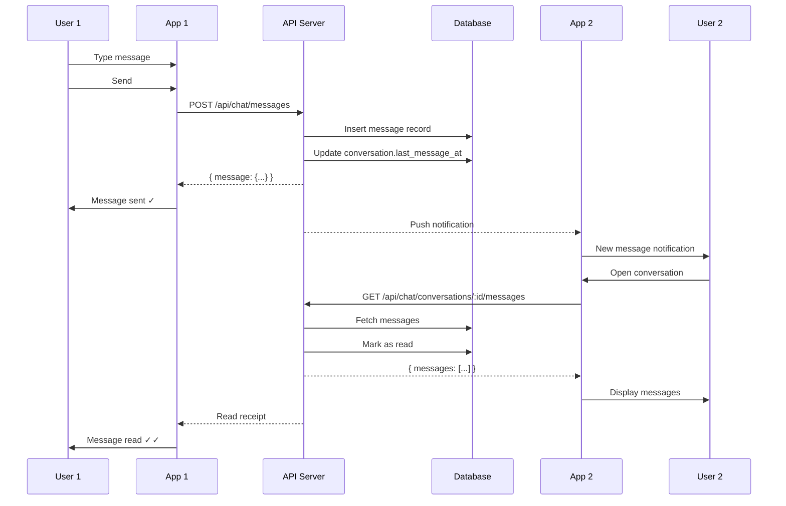
```mermaid
sequenceDiagram
    participant User1 as User 1
    participant App1 as App 1
    participant API as API Server
    participant DB as Database
    participant App2 as App 2
    participant User2 as User 2
    
    User1->>App1: Type message
    User1->>App1: Send
    App1->>API: POST /api/chat/messages
    API->>DB: Insert message record
    API->>DB: Update conversation.last_message_at
    API-->>App1: { message: {...} }
    App1->>User1: Message sent ✓
    
    API-->>App2: Push notification
    App2->>User2: New message notification
    
    User2->>App2: Open conversation
    App2->>API: GET /api/chat/conversations/:id/messages
    API->>DB: Fetch messages
    API->>DB: Mark as read
    API-->>App2: { messages: [...] }
    App2->>User2: Display messages
    
    API-->>App1: Read receipt
    App1->>User1: Message read ✓✓
```

### Property Search & Filter Flow

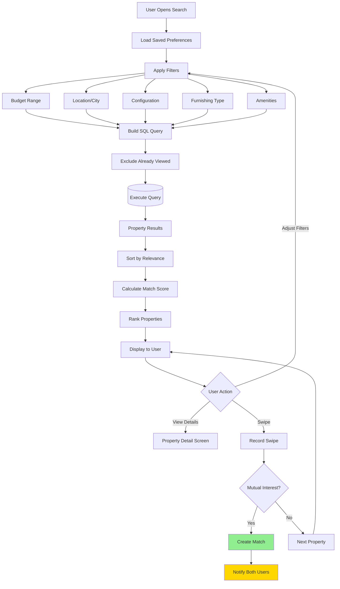
```mermaid
graph TD
    Start[User Opens Search] --> GetPrefs[Load Saved Preferences]
    
    GetPrefs --> Filters[Apply Filters]
    
    Filters --> Budget[Budget Range]
    Filters --> Location[Location/City]
    Filters --> Config[Configuration]
    Filters --> Furnishing[Furnishing Type]
    Filters --> Amenities[Amenities]
    
    Budget --> BuildQuery[Build SQL Query]
    Location --> BuildQuery
    Config --> BuildQuery
    Furnishing --> BuildQuery
    Amenities --> BuildQuery
    
    BuildQuery --> ExcludeViewed[Exclude Already Viewed]
    ExcludeViewed --> Query[(Execute Query)]
    
    Query --> Results[Property Results]
    Results --> Sort[Sort by Relevance]
    
    Sort --> Score[Calculate Match Score]
    Score --> Rank[Rank Properties]
    
    Rank --> Display[Display to User]
    
    Display --> UserAction{User Action}
    UserAction --> |View Details| PropertyDetail[Property Detail Screen]
    UserAction --> |Adjust Filters| Filters
    UserAction --> |Swipe| SwipeAction[Record Swipe]
    
    SwipeAction --> CheckMatch{Mutual Interest?}
    CheckMatch --> |Yes| CreateMatch[Create Match]
    CheckMatch --> |No| NextProperty[Next Property]
    
    CreateMatch --> Notify[Notify Both Users]
    NextProperty --> Display
    
    style CreateMatch fill:#90EE90
    style Notify fill:#FFD700
```

---

## Component Architecture

### Mobile App Structure

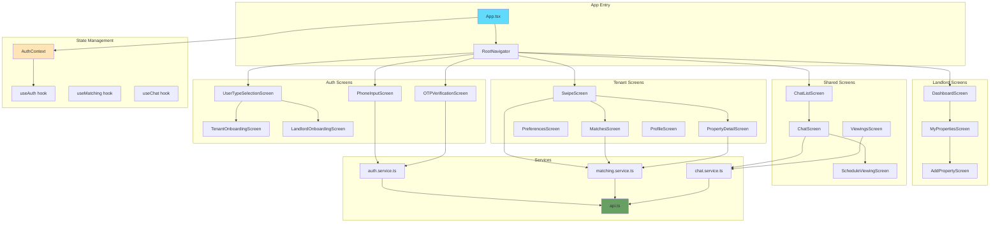
```mermaid
graph TD
    subgraph "App Entry"
        App[App.tsx]
        Nav[RootNavigator]
    end
    
    subgraph "Auth Screens"
        Phone[PhoneInputScreen]
        OTP[OTPVerificationScreen]
        UserType[UserTypeSelectionScreen]
        TOnboard[TenantOnboardingScreen]
        LOnboard[LandlordOnboardingScreen]
    end
    
    subgraph "Tenant Screens"
        Swipe[SwipeScreen]
        Matches[MatchesScreen]
        Preferences[PreferencesScreen]
        PropertyDetail[PropertyDetailScreen]
        TProfile[ProfileScreen]
    end
    
    subgraph "Landlord Screens"
        Dashboard[DashboardScreen]
        MyProperties[MyPropertiesScreen]
        AddProperty[AddPropertyScreen]
    end
    
    subgraph "Shared Screens"
        ChatList[ChatListScreen]
        Chat[ChatScreen]
        Viewings[ViewingsScreen]
        ScheduleViewing[ScheduleViewingScreen]
    end
    
    subgraph "Services"
        AuthService[auth.service.ts]
        MatchingService[matching.service.ts]
        ChatService[chat.service.ts]
        API[api.ts]
    end
    
    subgraph "State Management"
        AuthContext[AuthContext]
        useAuth[useAuth hook]
        useMatching[useMatching hook]
        useChat[useChat hook]
    end
    
    App --> Nav
    Nav --> Phone
    Nav --> OTP
    Nav --> UserType
    
    UserType --> TOnboard
    UserType --> LOnboard
    
    Nav --> Swipe
    Nav --> Dashboard
    Nav --> ChatList
    
    Swipe --> PropertyDetail
    Swipe --> Matches
    Dashboard --> MyProperties
    MyProperties --> AddProperty
    ChatList --> Chat
    Chat --> ScheduleViewing
    
    Swipe --> MatchingService
    Matches --> MatchingService
    PropertyDetail --> MatchingService
    
    Phone --> AuthService
    OTP --> AuthService
    
    Chat --> ChatService
    Viewings --> ChatService
    
    AuthService --> API
    MatchingService --> API
    ChatService --> API
    
    App --> AuthContext
    AuthContext --> useAuth
    
    style App fill:#61DAFB
    style API fill:#68A063
    style AuthContext fill:#FFE4B5
```

### API Controller Organization

```mermaid
graph LR
    subgraph "Routes"
        AuthRoute[/api/auth]
        MatchRoute[/api/matches]
        PropRoute[/api/properties]
        ChatRoute[/api/chat]
        ViewRoute[/api/viewings]
        UserRoute[/api/users]
    end
    
    subgraph "Controllers"
        AuthCtrl[auth.controller]
        MatchCtrl[matching.controller]
        PropCtrl[property.controller]
        ChatCtrl[chat.controller]
        ViewCtrl[viewing.controller]
    end
    
    subgraph "Services"
        TokenSvc[token.service]
        MatchSvc[matching.service]
        SMSSvc[sms.service]
        MapsSvc[maps.service]
        ChatSvc[chat.service]
    end
    
    subgraph "Database"
        DB[(PostgreSQL)]
    end
    
    AuthRoute --> AuthCtrl
    MatchRoute --> MatchCtrl
    PropRoute --> PropCtrl
    ChatRoute --> ChatCtrl
    ViewRoute --> ViewCtrl
    UserRoute --> AuthCtrl
    
    AuthCtrl --> TokenSvc
    AuthCtrl --> SMSSvc
    MatchCtrl --> MatchSvc
    PropCtrl --> MapsSvc
    ChatCtrl --> ChatSvc
    
    TokenSvc --> DB
    MatchSvc --> DB
    SMSSvc --> External[SMS Provider]
    MapsSvc --> Maps[Google Maps]
    ChatSvc --> DB
    
    style DB fill:#336791
    style External fill:#F22F46
    style Maps fill:#4285F4
```

---

## Deployment Architecture (Future)

```mermaid
graph TB
    subgraph "Client"
        MobileUsers[Mobile Users]
        WebUsers[Web Users]
    end
    
    subgraph "CDN"
        CloudFront[CloudFront CDN]
    end
    
    subgraph "Load Balancer"
        ALB[Application Load Balancer]
    end
    
    subgraph "API Servers"
        API1[API Server 1]
        API2[API Server 2]
        API3[API Server 3]
    end
    
    subgraph "Database Cluster"
        Primary[(Primary DB)]
        Replica1[(Replica 1)]
        Replica2[(Replica 2)]
    end
    
    subgraph "Cache Layer"
        Redis1[(Redis Master)]
        Redis2[(Redis Replica)]
    end
    
    subgraph "Storage"
        S3[S3 Bucket<br/>Property Photos]
    end
    
    subgraph "Monitoring"
        CloudWatch[CloudWatch Logs]
        Sentry[Sentry Error Tracking]
    end
    
    MobileUsers --> CloudFront
    WebUsers --> CloudFront
    CloudFront --> ALB
    
    ALB --> API1
    ALB --> API2
    ALB --> API3
    
    API1 --> Primary
    API2 --> Primary
    API3 --> Primary
    
    Primary --> Replica1
    Primary --> Replica2
    
    API1 --> Redis1
    API2 --> Redis1
    API3 --> Redis1
    
    Redis1 --> Redis2
    
    API1 --> S3
    API2 --> S3
    API3 --> S3
    
    API1 --> CloudWatch
    API2 --> CloudWatch
    API3 --> CloudWatch
    
    API1 --> Sentry
    API2 --> Sentry
    API3 --> Sentry
    
    style Primary fill:#336791
    style S3 fill:#FF9900
    style CloudWatch fill:#FF4F00
    style Sentry fill:#362D59
```

---

## State Machine Diagrams

### Match Status State Machine

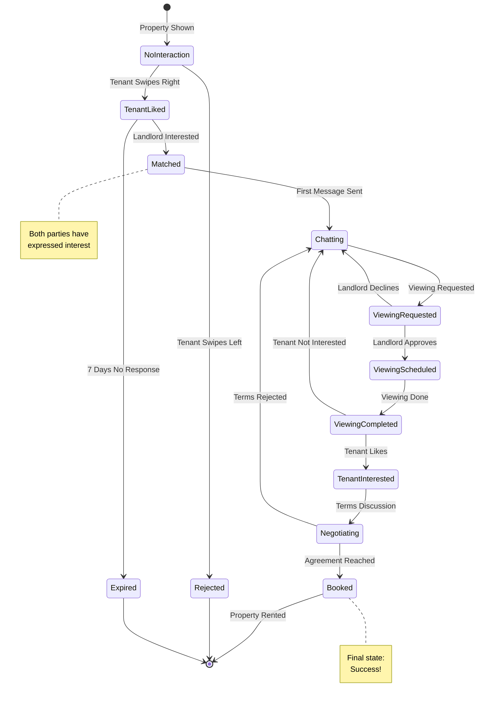
```mermaid
stateDiagram-v2
    [*] --> NoInteraction: Property Shown
    
    NoInteraction --> TenantLiked: Tenant Swipes Right
    NoInteraction --> Rejected: Tenant Swipes Left
    
    TenantLiked --> Matched: Landlord Interested
    TenantLiked --> Expired: 7 Days No Response
    
    Matched --> Chatting: First Message Sent
    Chatting --> ViewingRequested: Viewing Requested
    
    ViewingRequested --> ViewingScheduled: Landlord Approves
    ViewingRequested --> Chatting: Landlord Declines
    
    ViewingScheduled --> ViewingCompleted: Viewing Done
    ViewingCompleted --> TenantInterested: Tenant Likes
    ViewingCompleted --> Chatting: Tenant Not Interested
    
    TenantInterested --> Negotiating: Terms Discussion
    Negotiating --> Booked: Agreement Reached
    Negotiating --> Chatting: Terms Rejected
    
    Booked --> [*]: Property Rented
    Rejected --> [*]
    Expired --> [*]
    
    note right of Matched
        Both parties have
        expressed interest
    end note
    
    note right of Booked
        Final state:
        Success!
    end note
```

### Viewing Request State Machine

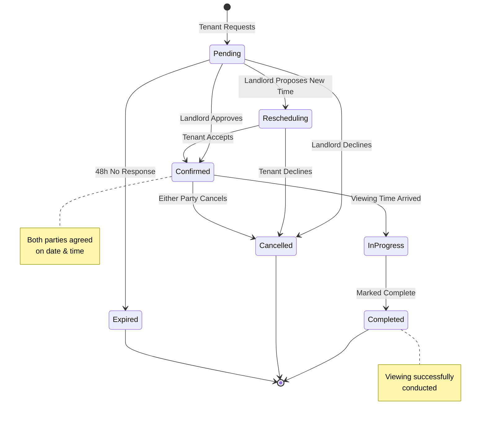
```mermaid
stateDiagram-v2
    [*] --> Pending: Tenant Requests
    
    Pending --> Confirmed: Landlord Approves
    Pending --> Rescheduling: Landlord Proposes New Time
    Pending --> Cancelled: Landlord Declines
    Pending --> Expired: 48h No Response
    
    Rescheduling --> Confirmed: Tenant Accepts
    Rescheduling --> Cancelled: Tenant Declines
    
    Confirmed --> InProgress: Viewing Time Arrived
    InProgress --> Completed: Marked Complete
    
    Confirmed --> Cancelled: Either Party Cancels
    
    Completed --> [*]
    Cancelled --> [*]
    Expired --> [*]
    
    note right of Confirmed
        Both parties agreed
        on date & time
    end note
    
    note right of Completed
        Viewing successfully
        conducted
    end note
```

---

## Performance & Scalability

### Caching Strategy

```mermaid
graph TD
    Request[API Request] --> CheckCache{In Cache?}
    
    CheckCache --> |Yes| ReturnCached[Return Cached Data]
    CheckCache --> |No| QueryDB[Query Database]
    
    QueryDB --> StoreCache[Store in Cache]
    StoreCache --> ReturnFresh[Return Fresh Data]
    
    ReturnCached --> Response[Response to Client]
    ReturnFresh --> Response
    
    subgraph "Cache Keys"
        K1[user:profile:{userId}]
        K2[property:{propertyId}]
        K3[matches:tenant:{tenantId}]
        K4[recommendations:{userId}]
    end
    
    subgraph "Cache TTL"
        T1[User Profile: 1 hour]
        T2[Property: 30 minutes]
        T3[Matches: 5 minutes]
        T4[Recommendations: 2 minutes]
    end
    
    CheckCache -.-> K1
    CheckCache -.-> K2
    CheckCache -.-> K3
    CheckCache -.-> K4
    
    style ReturnCached fill:#90EE90
    style QueryDB fill:#FFE4B5
```

---

## Security Flow

### JWT Authentication Flow

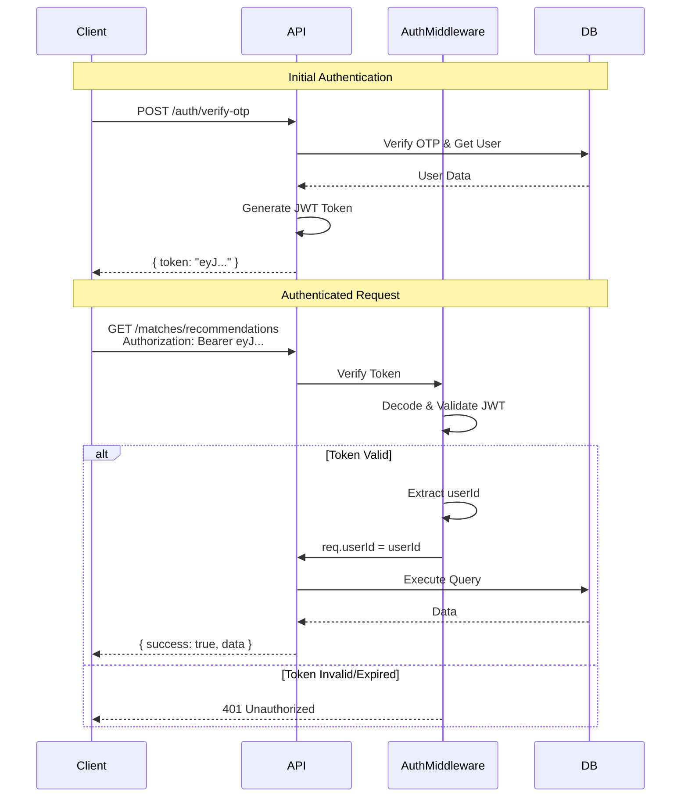
```mermaid
sequenceDiagram
    participant Client
    participant API
    participant AuthMiddleware
    participant DB
    
    Note over Client,DB: Initial Authentication
    Client->>API: POST /auth/verify-otp
    API->>DB: Verify OTP & Get User
    DB-->>API: User Data
    API->>API: Generate JWT Token
    API-->>Client: { token: "eyJ..." }
    
    Note over Client,DB: Authenticated Request
    Client->>API: GET /matches/recommendations<br/>Authorization: Bearer eyJ...
    API->>AuthMiddleware: Verify Token
    AuthMiddleware->>AuthMiddleware: Decode & Validate JWT
    
    alt Token Valid
        AuthMiddleware->>AuthMiddleware: Extract userId
        AuthMiddleware->>API: req.userId = userId
        API->>DB: Execute Query
        DB-->>API: Data
        API-->>Client: { success: true, data }
    else Token Invalid/Expired
        AuthMiddleware-->>Client: 401 Unauthorized
    end
```

---

*Last Updated: January 14, 2026*
*Version: 1.0.0*
